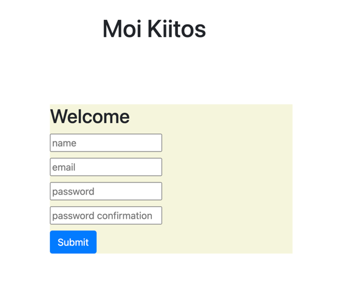
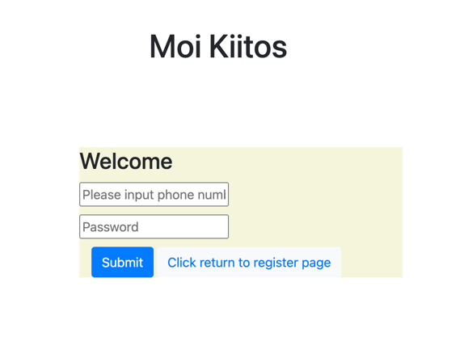
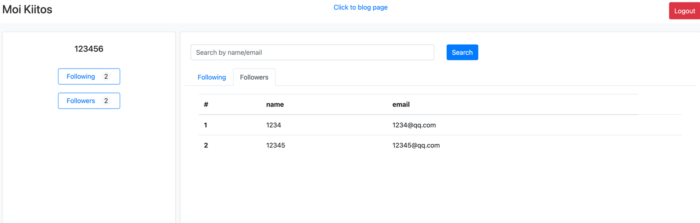
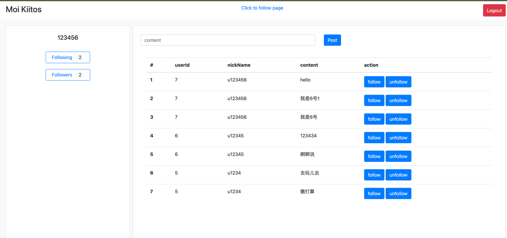

# Moikiitos

## Description

This project is a Spring Boot web application that does a mirco-blog system.
Integrated Spring Cloud related modules
Integrated MyBatis related modules
Front-end implemented using HTML, CSS, JavaScript, and jQuery
Database used is MySQL.
Using Java 17. Mysql8.0
Using SpringBoot 3.2.0
Using SpringBootTest and MockMvc modules

## Project Modules

1. User Module
2. User registration

3. User login

4. User follow
5. User unfollow

6. Blog post

7. Blog review

## Installation & Run

1. Clone the repository: `git clone git@github.com:roomyxie/moikiitos-demo.git` and switch to branch with dev-demo
2. Navigate to the project directory
3. Find the document of mysql, imports the DDL includes moikiitos.sql to mysql server.
4. imports the data files [mysql/data/data.sql]  to mysql server
5. Run com.moikiitos.MoikiitosApplication in IDEA. Or you can use [moikiitos-0.0.1-SNAPSHOT.jar] start the app
6. Access link [http://127.0.0.1:8017/user/login.html]
7. Use Account Tom/1234 or Jimmy/1234567 to login
8. Enjoy the app

## Usage

1. Run the application using Maven: `mvn spring-boot:run`
2. Or Run com.moikiitos.MoikiitosApplication.java
3. Access the application through a web browser at `http://localhost:8017/user/login.html`
4. You can register first. then login and us other modules

## Configuration

The application uses the default configuration. If you need to configure the application, refer to
resources/application.yml.

# Git Commit log 

Please check the file with log.txt in the root

# Unit file

Please check the unit test file in the test

## Support

If you have any questions or issues, please contact xiekuan at roomy.zw@hotmail.com.